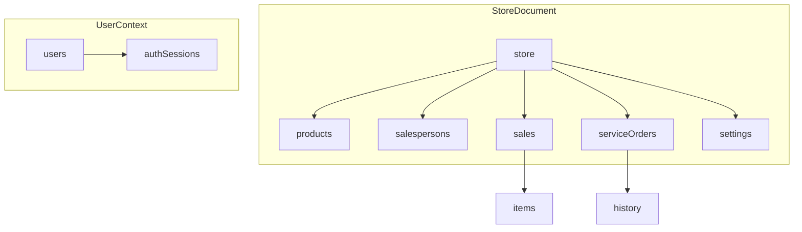
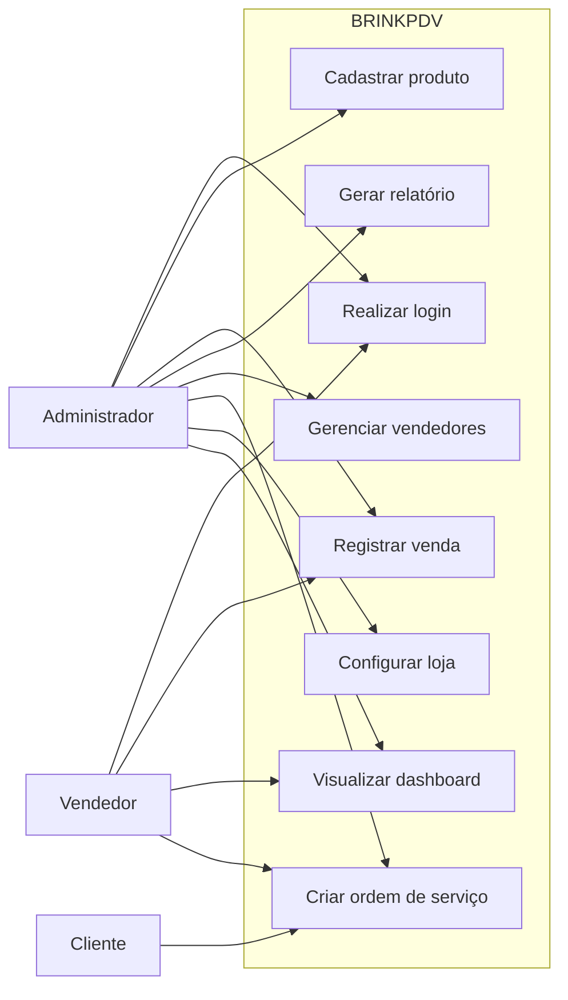

# Diagramas do projeto BRINKPDV

## 1. Diagrama relacional

Este modelo representa a estrutura relacional esperada para o sistema com base no esquema atual em [shared/schema.ts](shared/schema.ts).

```mermaid
erDiagram
    USERS ||--o{ SALES : realiza
    SALESPERSONS ||--o{ SALES : atende
    SALES ||--o{ SALES_ITEMS : contem
    PRODUCTS ||--o{ SALES_ITEMS : compoe
    CUSTOMERS ||--o{ SERVICE_ORDERS : solicita
    SERVICE_ORDERS ||--o{ SERVICE_ORDER_EVENTS : possui

    USERS {
        string id PK
        string username
        string password
        string role
    }

    SALESPERSONS {
        string id PK-------------------
        string name                   |
        string email                  |
        string phone                  |
        decimal commission            |
        decimal totalSales            |
        boolean active                |
        date entryDate                |
    }                                 |                                                                        |
                                      |
    PRODUCTS {                        |
        string id PK                  |
        string sku                    |
        string name                   |
        string category               |
        decimal price                 |
        int stock                     |
        string image                  |
    }                                 |
    SALES {                           |
        string id PK                  |
        string salespersonId FK -------                        
        decimal total
        string paymentMethod
        string items
        string observation
        datetime createdAt
    }

    SALES_ITEMS {
        string id PK
        string saleId FK
        string productId FK
        int quantity
        decimal unitPrice
        decimal total
    }

    CUSTOMERS {
        string id PK
        string name
        string phone
        string email
        string address
    }

    SERVICE_ORDERS {
        string id PK
        string orderNumber
        string customerId FK
        string device
        string issue
        string status
        string priority
        decimal value
        date date
        date deadline
        date exitDate
    }

    SERVICE_ORDER_EVENTS {
        string id PK
        string orderId FK
        string eventType
        string description
        datetime createdAt
    }

    STORE_SETTINGS {
        string id PK
        string storeName
        string storeLogo
    }
```

## 2. Diagrama não relacional

Este modelo mostra uma abordagem orientada a documentos, útil se o sistema evoluir para um backend NoSQL mais flexível.



### Exemplo de estrutura documental

- users
  - id
  - username
  - passwordHash
  - role
  - active

- stores
  - id
  - name
  - logo
  - currency
  - settings

- products
  - id
  - sku
  - name
  - category
  - price
  - stock
  - image

- sales
  - id
  - salespersonId
  - paymentMethod
  - total
  - items[]
  - observation
  - createdAt

- serviceOrders
  - id
  - orderNumber
  - customer
  - device
  - issue
  - status
  - priority
  - value
  - history[]

## 3. Diagrama de caso de uso



## Observação

- O modelo relacional é o mais alinhado com o estado atual do projeto.
- O modelo não relacional é uma proposta de evolução para um backend mais flexível e escalável.
- O caso de uso mostra os principais fluxos de negócio do sistema PDV.
